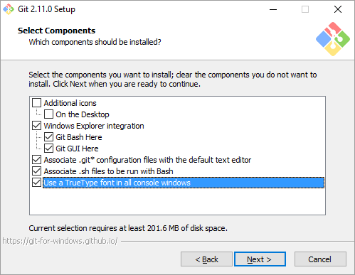
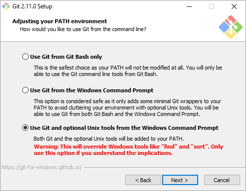
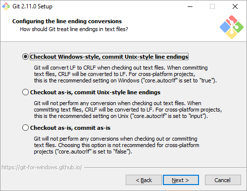
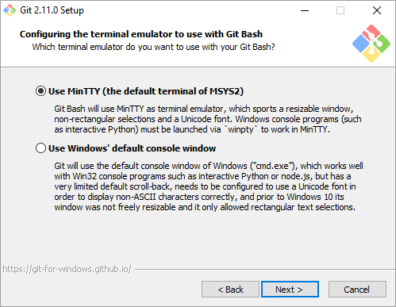
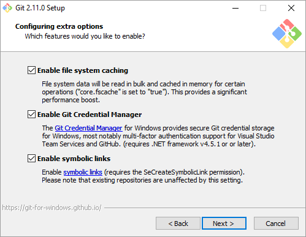
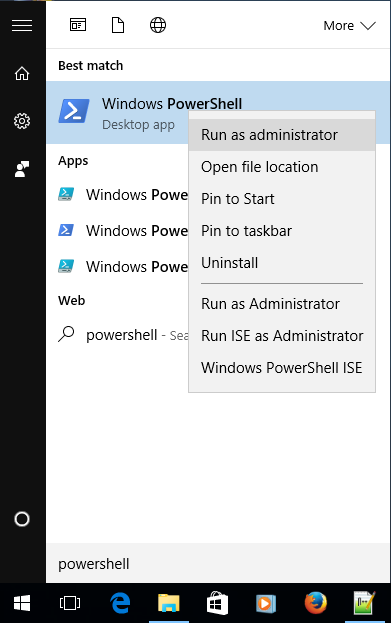

`/!\ IMPORTANT`: this is a **hands-on** tutorial: participants are expected bring a laptop and pre-install software _in advance_ to make the best use of time during the tutorial.
If for some reason you are unable to fulfill this pre-requisite, try to seat close to an attendee that is able to perform these tasks.

_Note_: in the following instructions, terminal commands are prefixed by a virtual prompt `$>`which obviously **does not** belong to the command.

## Preliminaries

* Create in advance the various accounts for the **cloud services** we will use, _i.e._:
    - [Github](https://github.com/):
    - [Vagrant Cloud](https://vagrantcloud.com/)
    - [Docker Hub](https://hub.docker.com/)

* Install the following software, depending on your running platform:

| Platform      | Software                                                                                       | Description                           | Usage                   |
|---------------|------------------------------------------------------------------------------------------------|---------------------------------------|-------------------------|
| Mac OS        | [Homebrew](http://brew.sh/)                                                                    | The missing package manager for macOS | `brew install ...`      |
| Mac OS        | [Brew Cask Plugin](https://caskroom.github.io)                                                 | Mac OS Apps install made easy         | `brew cask install ...` |
| Mac OS        | [iTerm2](https://www.iterm2.com/)                                                              | _(optional)_ enhanced Terminal        |                         |
| Windows       | [Git for Windows](https://git-for-windows.github.io/)                                          | I'm sure you guessed                  |                         |
| Windows       | [SourceTree](https://www.sourcetreeapp.com/)                                                   | _(optional)_ enhanced git GUI         |                         |
| Windows/Linux | [Virtual Box](https://www.virtualbox.org/)                                                     | Free hypervisor provider for Vagrant  |                         |
| Windows/Linux | [Vagrant](https://www.vagrantup.com/downloads.html)                                            | Reproducible environments made easy.  |                         |
| Windows       | [Docker for Windows](https://docs.docker.com/engine/installation/windows/#/docker-for-windows) | Lightweight Reproducible Containers   |                         |

* Follow the below custom instructions depending on your running platform

## Mac OS X

Now that you have [Homebrew](http://brew.sh/) installed:

~~~bash
$> brew install git-core git-flow    # (newer) Git stuff
$> brew tap caskroom/cask            # install brew cask  -- see https://caskroom.github.io/
$> brew cask install virtualbox      # install virtualbox -- see https://www.virtualbox.org/
$> brew cask install vagrant         # install Vagrant    -- see https://www.vagrantup.com/downloads.html
$> brew cask install vagrant-manager # see http://vagrantmanager.com/
$> brew cask install docker          # install Docker -- https://docs.docker.com/engine/installation/mac/
~~~

## Linux

Use your distribution package manager to install the appropriate packages for [Vagrant](https://www.vagrantup.com):

If you are running __Ubuntu / Debian__:

~~~bash
$> sudo apt-get install git-flow rubygems virtualbox vagrant virtualbox-dkms
~~~

If you are running __CentOS / RedHat / Fedora__

~~~bash
$> sudo yum install git gitflow
~~~

For the rest, it's [a little more tricky](http://tecadmin.net/install-oracle-virtualbox-on-centos-redhat-and-fedora/):

~~~bash
#== CentOS / RedHat ==
# Add Required Yum Repositories
$> cd /etc/yum.repos.d
# For CentOS/RHEL Systems:
$> sudo wget http://download.virtualbox.org/virtualbox/rpm/rhel/virtualbox.repo
# For Fedora Systems:
$> wget http://download.virtualbox.org/virtualbox/rpm/fedora/virtualbox.repo

# For CentOS/RHEL 7, 64 Bit (x86_64): add  EPEL yum repository
$> rpm -Uvh http://epel.mirror.net.in/epel/7/x86_64/e/epel-release-7-8.noarch.rpm
# CentOS/RHEL 6, 64 Bit (x86_64): add EPEL yum repository
$>  rpm -Uvh http://epel.mirror.net.in/epel/6/x86_64/epel-release-6-8.noarch.rpm

# Install required packages
$> yum install gcc make patch  dkms qt libgomp kernel-headers kernel-devel fontforge binutils glibc-headers glibc-devel
# Setup Environment Variable as VirtualBox installation required kernel source code to install required modules
$> export KERN_DIR=/usr/src/kernels/2.6.32-504.3.3.el6.x86_64   # Adapt accordingly from 'uname -a'
$> yum install VirtualBox-5.1

# After installation we need to rebuild kernel modules
$> service vboxdrv setup
~~~

Check that you can run `virtualbox` now.

* For [Docker](https://docker.com/), choose your distribution from https://docs.docker.com/engine/installation/linux/
and follow the instructions.
You need a reasonably new kernel version (3.10 or higher).
Here are detailed instuctions per OS:

* [Ubuntu](https://docs.docker.com/engine/installation/linux/docker-ce/ubuntu/)
* [Debian](https://docs.docker.com/engine/installation/linux/docker-ce/debian/)
* [CentOS](https://docs.docker.com/engine/installation/linux/docker-ce/centos/)

## Windows

On Windows (10, 7/8 should also be OK) you should download and install the following tools:

* [VirtualBox](https://www.virtualbox.org/wiki/Downloads), download the latest [VirtualBox installer](https://download.virtualbox.org/virtualbox/5.2.6/VirtualBox-5.2.6-120293-Win.exe) and [Extension pack](https://download.virtualbox.org/virtualbox/5.2.6/Oracle_VM_VirtualBox_Extension_Pack-5.2.6-120293.vbox-extpack).

First, install VirtualBox with the default settings. Note that a warning will be issued that your network connections will be temporarily impacted, you should continue.
Then, run the downloaded extension pack (.vbox-extpack file), it will open within the VirtualBox Manager and you should let it install normally.

* [Vagrant](https://www.vagrantup.com/downloads.html), download the latest [Vagrant installer](https://releases.hashicorp.com/vagrant/2.0.1/vagrant_2.0.1_x86_64.msi)

Proceed with the installation, no changes are required to the default setup.

* [Git](https://git-scm.com/downloads), download the latest [Git installer](https://git-scm.com/download/win)

The Git installation requires a few changes to the defaults, make sure the following are selected in the installer:

   - Select Components: _Use a TrueType font in all console windows)_
   - Adjusting your PATH environment: _Use Git and optional Unix tools from the Windows Command Prompt_
   - Configuring the line ending conversions: _Checkout Windows-style, commit Unix-style line endings)_
   - Configuring the terminal emulator to use with Git Bash: _Use MinTTY (the default terminal of MSYS2)_
   - Configuring extra options: _Enable symbolic links_

Please note that to clone a Git repository which contains symbolic links (symlinks), you **must start a shell** (Microsoft PowerShell in this example, but a Command Prompt - cmd.exe - or Git Bash shell should work out fine) **with elevated (Administrator) privileges**. This is required in order for git to be able to create symlinks on Windows:

* Start Powershell:
    1. In the Windows Start menu, type PowerShell
    2. Normally PowerShell will appear as the first option on the top as **Best match**
    3. Right click on it and select "Run as administrator"

A PowerShell window will appear and you can type your commands in it, e.g.:

~~~bash
cd $HOME
git --version
vagrant --version
~~~

* Optional - [Docker](https://www.docker.com/):
     - As a fallback solution for _older_ version of Windows (or Mac OS), you can use the [Docker Toolbox](https://www.docker.com/products/docker-toolbox):
<https://docs.docker.com/engine/installation/windows/#/docker-for-windows>. It uses VirtualBox instead of the Linux native virtualization technologies.

### Post-Installations checks

__Git__:

(Eventually) Make yourself known to Git

~~~bash
$> git config –-global user.name  "Firstname LastName"              # Adapt accordingly
$> git config –-global user.email "Firstname.LastName@domain.org"   # Adapt with your mail
~~~

Clone the [tutorial repository](https://github.com/Falkor/RR-tutorials) from a Terminal (Powershell as `administrator` under windows):

~~~bash
$> git clone https://github.com/Falkor/RR-tutorials.git
$> cd RR-tutorials
$> make setup    # Under Mac OS / Linux
~~~

__Vagrant__:

At the root of the `RR-tutorials/` directory, you should have a `Vagrantfile`.

* check it and ensure that the [vagrant](https://www.vagrantup.com) command-line is operational:

~~~bash
$> ls
LICENSE     Makefile    README.md   VERSION     Vagrantfile docs        mkdocs.yml  slides
$> vagrant --version
Vagrant 1.9.1
~~~

* let it download the vagrant boxes used for this tutorial in the background while you listen to the keynote ;)

~~~bash
$> vagrant up      # From the [freshly cloned] root directory of the RR-tutorials repository
~~~

`/!\ IMPORTANT`: downloading the configured images (~500MB) takes some time (~10 min). Depending on the number of participants of this tutorial, it may be necessary (and faster) to upload the box directly from a USB stick the technical support team will have prepared.

~~~bash
$> vagrant box add RR-tutorials /path/to/usb/ubuntu-trusty64-RR.box    # define local box 'RR-tutorials'
$> sed -i "s/svarrette\///" Vagrantfile      # Remove 'svarrette/' prefix in Vagrantfile
~~~

As there may be connection

__Docker__

In parallel, check that [Docker](https://www.docker.com/) works:

~~~bash
$> docker info
Containers: 9
 Running: 0
 Paused: 0
 Stopped: 9
Images: 12
Server Version: 1.12.3
[...]
~~~

*  Pull the docker containers we will need for the second part of this tutorial

~~~bash
$> docker pull ubuntu:14.04
~~~

* Login onto you [Docker hub account](https://hub.docker.com/) (take note of your Docker Hub ID and password).
    - With docker installed, run

~~~bash
$ docker login -u <your docker hub ID>
~~~
and enter your password.

Note that if the Docker installation fails, you can use <http://play-with-docker.com/> to try Docker, but **it won't work if all of us try it once!**
So use it only as a last resort, and it is up to you to use any important information (like the Docker hub account) inside it.
